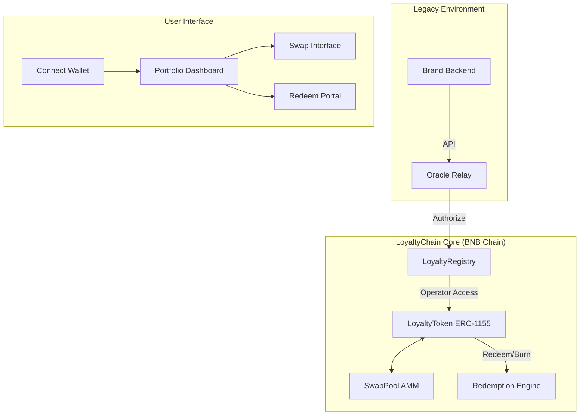

<div align="center">

# 🔗 LoyaltyChain Protocol

### The Global Liquidity Layer for Loyalty Points & RWAs
**Tokenizing $300B+ of unredeemed loyalty value on BNB Chain**

[](https://opbnb.bnbchain.org/)
[](https://soliditylang.org/)
[](https://nextjs.org/)
[](LICENSE)

[**Explore Demo**](https://loyalty-chain.vercel.app/) · [**Smart Contracts**](contracts/) · [**View Architecture**](#-architecture)

</div>

---

## 💎 Overview

LoyaltyChain is a decentralized protocol designed to solve the "Siloed Rewards" problem. By tokenizing 1:1 backed airline miles, hotel points, and retail rewards into **ERC-1155 Real-World Assets (RWAs)**, we enable a frictionless secondary market where users can swap, trade, and redeem points across different brands instantly.

> [!IMPORTANT]
> **Built for RWA Demo Day 2026**: This project demonstrates the power of BNB Chain for high-throughput, low-fee tokenization of traditional financial assets.

---

## 📊 The $300B Liquidity Gap

Current loyalty programs are fragmented, restrictive, and suffer from high breakage rates:

| Pain Point | Traditional System | LoyaltyChain Solution |
| :--- | :--- | :--- |
| **Liquidity** | 0% (Points are locked) | **100% (Tradeable on AMMs)** |
| **Expiry** | Silent & Unfair | **Transparent & On-chain** |
| **Interoperability** | None | **Cross-brand Swaps (UniSwap Style)** |
| **Redemption** | Opaque processes | **Atomic Burn-to-Redeem** |

---

## 🏗️ Architecture Deep Dive

### High-Level System Design



### Core Components

1.  **LoyaltyRegistry.sol**: A central directory for verified brands. It stores metadata, logos, and authorized operator addresses.
2.  **LoyaltyToken.sol**: A multi-token standard (ERC-1155) where each `tokenId` represents a specific brand's points (e.g., Token 0 = Indigo Miles).
3.  **SwapPool.sol**: A specialized AMM using a Constant Product formula modified to handle ERC-1155 assets, enabling instant cross-brand liquidity.

---

## 🚀 Key Features

### 🌈 Premium Dashboard
A high-end, glassmorphism-based interface built with **Next.js 14** and **Framer Motion**, offering a unified view of all tokenized assets.

### 🔄 Cross-Brand Swaps
Swap your hotel points for airline miles in a single transaction. Powered by an on-chain AMM with live price impact assessment.

### 🛡️ Secure Redemption
Uses an atomic "Burn-to-Redeem" mechanism. Tokens are verifiably destroyed on-chain in exchange for a unique off-chain claim code.

---

## 🛠️ Technical Stack

-   **Blockchain**: BNB Chain (BSC Testnet)
-   **Smart Contracts**: Solidity 0.8.25, Hardhat, OpenZeppelin
-   **Frontend**: Next.js 14 (App Router), TailwindCSS, Framer Motion
-   **Web3**: Wagmi v2, Viem, RainbowKit

---

## 🏃 Getting Started

### Prerequisites

-   Node.js 18+ & npm/yarn
-   MetaMask or any EIP-1193 wallet
-   BSC Testnet BNB ([Faucet link](https://testnet.bnbchain.org/faucet-smart))

### 1. Installation

```bash
# Clone and enter directory
git clone https://github.com/Shikhyy/LoyaltyChain.git
cd LoyaltyChain

# Install all dependencies (Root + Frontend)
npm install
cd frontend && npm install && cd ..
```

### 2. Contract Deployment (Local/Testnet)

Create a `.env` in the root:
```env
PRIVATE_KEY=your_private_key_here
BSCSCAN_API_KEY=your_api_key_here
```

```bash
# Compile contracts
npx hardhat compile

# Deploy to BSC Testnet
npx hardhat run scripts/deploy.ts --network bscTestnet
```

### 3. Frontend Execution

Update `frontend/.env.local` with the deployed addresses:
```env
NEXT_PUBLIC_REGISTRY_ADDRESS=0x...
NEXT_PUBLIC_TOKEN_ADDRESS=0x...
NEXT_PUBLIC_SWAP_ADDRESS=0x...
```

```bash
cd frontend
npm run dev
```

---

## 🧪 Testing

We value security. Our contracts are covered by a comprehensive test suite.

```bash
npx hardhat test
```

> [!TIP]
> Run `npx hardhat coverage` to see detailed line-by-line coverage reports for the protocol.

---

## 🗺️ Roadmap

- [x] ERC-1155 Tokenization Logic
- [x] Basic AMM Swap Pool
- [x] Premium Glassmorphism UI
- [ ] **Multi-Asset Single Pool**: Trade any token for a stablecoin "Hub"
- [ ] **Dynamic Pricing Oracles**: Real-time RWA value pegging
- [ ] **Mobile App**: Native iOS/Android experience

---

## 🤝 Contributing

We welcome contributions! Please see our [Contributing Guidelines](CONTRIBUTING.md) for details.

---

## 📄 License

This project is licensed under the MIT License - see the [LICENSE](LICENSE) file for details.

<div align="center">
<br />

**Built with ❤️ on BNB Chain for RWA Demo Day 2026**


</div>
