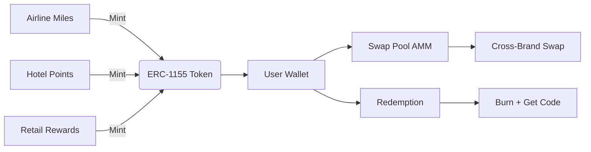
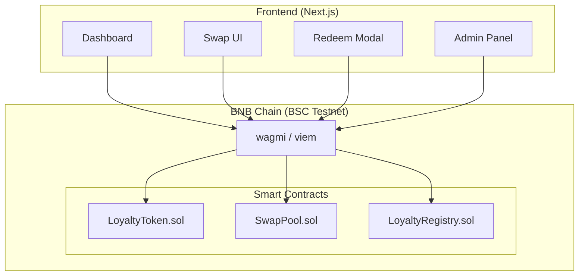
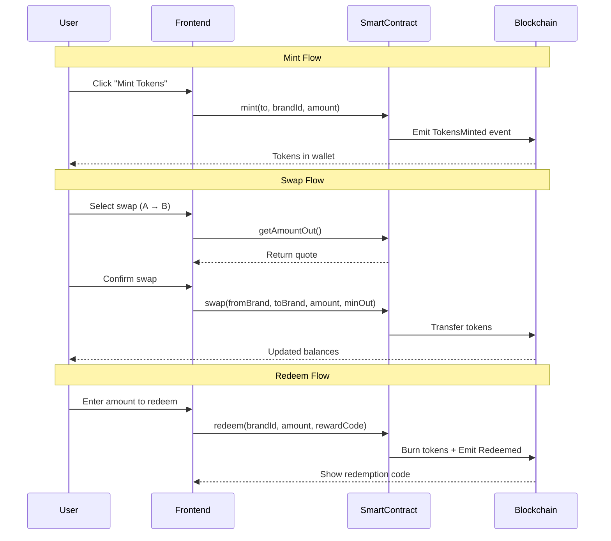

<div align="center">

# 🔗 LoyaltyChain

### Tokenizing Loyalty Points on BNB Chain

<p align="center">
  
  
  
  
</p>

**Convert siloed airline miles, hotel points, and retail rewards into freely tradeable ERC-1155 tokens on BNB Chain**

---

## 🎯 The Problem

| Statistic | Value |
|-----------|-------|
| Global unredeemed loyalty points | **$300B+** |
| Points that go unused annually | **Trillions** |
| Average expiry rate | **25-30%** |
| Secondary market availability | **None** |

### Current Issues:
- Points are locked to a single brand with no transferability
- Silent expiration loses users millions yearly  
- No way to swap Airtel → MakeMyTrip miles
- Cannot sell points for stablecoins

---

## 💡 Our Solution

LoyaltyChain tokenizes loyalty points as on-chain RWA tokens:



### How It Works:
1. **Brand Operators** mint their points as ERC-1155 tokens (1 token = 100 miles)
2. **Users** hold tokens in any BNB Chain wallet
3. **Cross-brand swaps** via on-chain AMM-style pool
4. **Redemption** burns tokens and emits redemption event

---

## 🏗️ Architecture

### System Overview



### Smart Contracts

| Contract | Purpose | Standard |
|----------|---------|----------|
| `LoyaltyRegistry.sol` | Stores brand metadata | Ownable |
| `LoyaltyToken.sol` | ERC-1155 multi-token | ERC-1155 |
| `SwapPool.sol` | AMM swap pool | Ownable |

### Data Flow



---

## 🚀 Features

### ✅ Implemented

- [x] **Portfolio Dashboard** - View all brand token balances
- [x] **Token Swap** - Cross-brand AMM swaps with live quotes
- [x] **Token Redemption** - Burn tokens for redemption codes
- [x] **Admin Panel** - Operator minting interface
- [x] **Wallet Connection** - RainbowKit + MetaMask support
- [x] **BSC Testnet** - Ready for testnet deployment
- [x] **Mobile Responsive** - Bottom tab navigation
- [x] **Transaction History** - Live event feed
- [x] **Swap Quote Preview** - Debounced live quotes with price impact

### 📋 Roadmap

- [ ] **BscScan Verification** - Verified contract explorer
- [ ] **Mainnet Deployment** - BSC Mainnet ready
- [ ] **Dynamic Pricing Oracles** - Real-time RWA value pegging
- [ ] **Mobile App** - Native iOS/Android experience

---

## 🛠️ Tech Stack

### Backend
```
Solidity     → Smart Contracts (0.8.25)
Hardhat      → Development Framework
OpenZeppelin → Security & Standards
```

### Frontend
```
Next.js 14   → React Framework
wagmi v2     → Ethereum Interaction
viem         → Low-level Ethereum
RainbowKit   → Wallet UI
TailwindCSS  → Styling
Framer Motion → Animations
TypeScript   → Type Safety
```

### Infrastructure
```
BNB Chain    → Blockchain (Testnet: 97)
Vercel       → Frontend Hosting
```

---

## 📁 Project Structure

```
loyaltychain/
├── contracts/
│   ├── LoyaltyRegistry.sol    # Brand metadata storage
│   ├── LoyaltyToken.sol       # ERC-1155 multi-token
│   └── SwapPool.sol          # AMM swap pool
├── scripts/
│   └── deploy.ts             # Deployment script
├── test/
│   ├── LoyaltyRegistry.ts    # Registry tests
│   ├── LoyaltyToken.ts       # Token tests
│   └── SwapPool.ts          # AMM tests
├── frontend/
│   ├── app/
│   │   ├── layout.tsx        # Root layout
│   │   ├── page.tsx         # Portfolio dashboard
│   │   ├── swap/            # Swap interface
│   │   ├── redeem/          # Redemption flow
│   │   └── admin/           # Operator panel
│   └── lib/
│       ├── wagmiConfig.ts   # BSC config
│       ├── contracts.ts     # ABIs
│       └── mockBrands.ts   # Demo data
├── hardhat.config.ts
├── package.json
└── README.md
```

---

## 🏃‍♂️ Quick Start

### Prerequisites
- Node.js 18+
- npm or yarn
- MetaMask wallet

### Installation

```bash
# Clone the repository
git clone https://github.com/Shikhyy/LoyaltyChain.git
cd LoyaltyChain

# Install root dependencies
npm install

# Install frontend dependencies
cd frontend && npm install && cd ..
```

### Environment Setup

Create `.env` in root:
```env
PRIVATE_KEY=your_wallet_private_key
BSCSCAN_API_KEY=your_bscscan_api_key
```

Create `frontend/.env.local`:
```env
NEXT_PUBLIC_WALLETCONNECT_ID=your_walletconnect_project_id
NEXT_PUBLIC_REGISTRY_ADDRESS=0x...
NEXT_PUBLIC_TOKEN_ADDRESS=0x...
NEXT_PUBLIC_SWAP_ADDRESS=0x...
```

### Deploy Contracts

```bash
# Compile contracts
npm run compile

# Deploy to BSC Testnet
npm run deploy -- --network bscTestnet
```

### Run Frontend

```bash
cd frontend
npm run dev
```

Visit `http://localhost:3000`

---

## 🧪 Testing

Run the test suite:

```bash
npm test
```

Expected output:
```
40 passing (1s)
```

---

## 📱 Demo Brands

| Brand | Symbol | Category | Points/Token |
|-------|--------|----------|--------------|
| IndiGo Miles | IGM | Airline | 100 |
| Air India Points | AIP | Airline | 100 |
| OYO Rewards | OYO | Hotel | 50 |
| Taj InnerCircle | TAJ | Hotel | 50 |
| Flipkart SuperCoins | FKC | Retail | 10 |
| Tata Neu Points | NEU | Retail | 10 |

---

## 🔗 Contract Addresses (Testnet)

_After deployment, addresses will be logged and should be added to `frontend/.env.local`_

---

## 📄 License

MIT License - see [LICENSE](LICENSE) for details.

---

## 👥 Team

**LoyaltyChain** - RWA Demo Day Hackathon Submission

---

## 🙏 Acknowledgments

- [BNB Chain](https://www.bnbchain.org) - Blockchain Infrastructure
- [OpenZeppelin](https://openzeppelin.com) - Smart Contract Standards
- [wagmi](https://wagmi.sh) - Ethereum React Hooks
- [RainbowKit](https://www.rainbowkit.com) - Wallet Connection UI

---

<div align="center">

**Built for RWA Demo Day · DoraHacks · March 2026**


</div>
